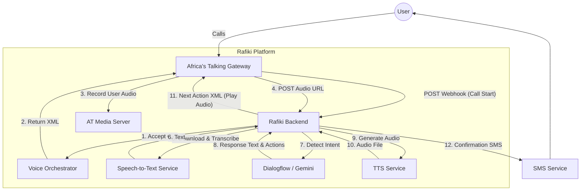

# Voice Integration Strategy: Rafiki.ai x Africa's Talking

## Executive Summary
This document outlines the strategy for integrating **Africa's Talking (AT) Voice API** into the **Rafiki.ai** platform. The goal is to provide a seamless, conversational experience where users can access eCitizen services via a standard phone call, mirroring the capabilities of our existing chatbot.

## The "Seamless" User Experience
To ensure the experience feels natural and "seamless" rather than robotic, we will implement the following UX principles:

### 1. Natural Conversation Flow
Instead of a rigid IVR menu ("Press 1 for Passport"), users will speak naturally.
*   **User:** "I want to renew my passport."
*   **System:** "I can help with that. What is your ID number?"

### 2. Low Latency Responses
Delays break immersion. We will optimize for speed:
*   **Streamlined Pipeline:** AT Audio -> fast transcription -> Intent Detection -> Pre-cached TTS Audio wherever possible.
*   **Audio Hints:** Play a subtle "thinking" sound or filler word ("Um", "Let me check") if processing takes >1 second.

### 3. Context Awareness
The system will remember context within the call.
*   If a user says "renew it", the system knows "it" refers to the passport discussed previously.
*   If the call drops, the system can text the user a link or resume context if they call back immediately.

### 4. Multi-Modal Feedback
*   **Voice + SMS:** After completing a task (e.g., booking an appointment), the system immediately sends an SMS confirmation.
*   **Error Handling:** If the system cannot understand the user after 3 attempts, it gracefully falls back to offering an SMS menu or transferring to a human agent (if available).

---

## Technical Architecture

### Component Breakdown

1.  **Africa's Talking (Gateway):** Handles the telephony. It accepts calls, plays our audio files, records user speech, and sends us webhooks.
2.  **Rafiki Backend (Orchestrator):**
    *   **`AfricasTalkingVoiceService`:** The new brain. It maintains the "state" of the call.
    *   **Router:** Receives HTTP POST requests from AT.
3.  **Speech-to-Text (STT):** Converts the user's recorded audio URL from AT into text.
4.  **Dialogflow / Gemini (Brain):** Determines what the user wants (Intent) and what info is missing (Entities).
5.  **Text-to-Speech (TTS):** Converts our text response into an audio file (MP3/WAV) that AT can play back to the user.

---

## Detailed Logic Flow

### Phase 1: Call Initiation
1.  User Calls Phone Number.
2.  AT hits `POST /webhooks/voice`.
3.  **Backend:** Checks if the number is known.
    *   *Known:* "Welcome back, [Name]. Are you calling about your [Service] appointment?"
    *   *Unknown:* "Welcome to eCitizen Voice Assistant. I can help you book Passports, IDs, and more. How can I help you?"
4.  **Backend:** Returns XML `<Response><Say>Welcome...</Say><Record/></Response>`.

### Phase 2: The Loop (Interaction)
1.  **AT:** Plays welcome message. Records user response.
2.  **AT:** Hits `POST /webhooks/voice` with `recordingUrl`.
3.  **Backend:**
    *   Downloads audio from `recordingUrl`.
    *   Transcribes audio to text.
    *   Sends text to **DialogflowService**.
    *   **Dialogflow:** Returns response text (e.g., "Please say your ID number") and updated state.
    *   Generates audio for the response (or uses pre-generated file).
    *   Uploads audio to a public URL (or serves it directly).
4.  **Backend:** Returns XML `<Response><Play url=".../response.mp3"/><Record/></Response>`.

### Phase 3: Action & Termination
1.  User provides all necessary info (Service, Date, Name).
2.  **Backend:** Books the appointment in the database.
3.  **Backend:** Triggers `SMSService` to send confirmation.
4.  **Backend:** Returns XML `<Response><Say>Booking confirmed. Check your SMS. Goodbye.</Say><Hangup/></Response>`.

---

## Handling Edge Cases (The "Rough Edges")

| Challenge | Solution |
| :--- | :--- |
| **Heavy Accents** | Use a robust STT model (Google Speech or OpenAI Whisper) trained on diverse accents. Fallback to keypad input if voice fails 3 times (`<GetDigits>`). |
| **Silence / No Input** | If `<Record>` times out, AT sends a "timeout" event. We catch this and play a prompt: "I didn't hear you. Please try again." |
| **Interruption** | AT's basic `<Say>` cannot be easily interrupted by speech without specialized "Barge-in" features. To mimic this, we keep prompts short and allow the user to speak immediately after. |
| **Latency** | Pre-generate common audio files ("Welcome", "Please wait", "Goodbye") so they play instantly. Only generate dynamic TTS (reading names/dates) on the fly. |

## Next Steps for Implementation
1.  **Setup:** Configure Africa's Talking "Callback URL" to point to our secure tunnel (ngrok) or deployed server.
2.  **Develop:** Build the `AfricasTalkingVoiceService` to generate the XML logic.
3.  **Test:** Use a real phone to dial the sandbox number and verify the flow.
